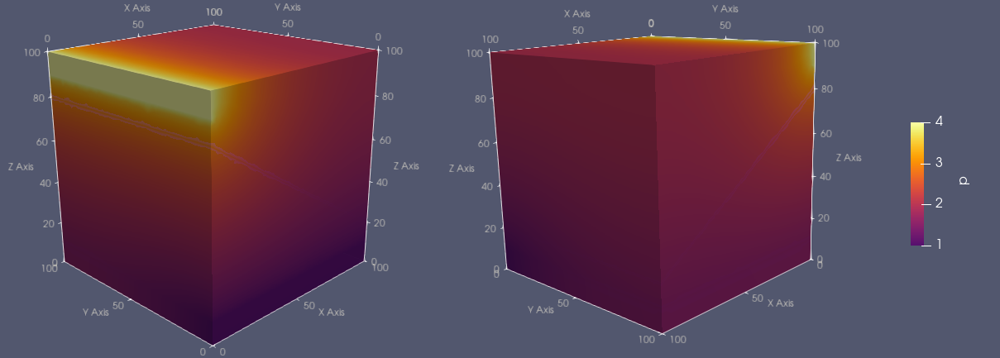

# Frac3D/LagrangeMultiplier

Solution of 3D fluid flow problems in porous media with three subdomains using Lagrange multipliers to handle the continuity of the solution across the interfaces.

## Problem Description

The problem is to find  such that

and .

Using a domain decomposition approach for , we introduce two Lagrange multipliers to handle the continuity of the solution across the interfaces  and . The resulting weak formulation is find , , ,  and , such that

for all  and  and

for all  and .

## Numerical Solution

### Subdomains:

The domain is decomposed into three subdomains:
- Upper subdomain  (gray color, ID 19), with ;
- Lower subdomain  (red color, ID 20), with ;
- Bottom subdomain  (blue color, ID 18), with .

	

### Boundaries:

The boundaries are subdivided into two Dirichlet boundaries and one Neumann boundary:
- Dirichlet boundary  (narrow band defined by , ID 32), with prescribed ;
- Dirichlet boundary  (narrow band defined by , ID 31), with prescribed ;
- Neumann boundary .

	

### Results:

The solution is obtained using second degree Lagrange elements.

	

