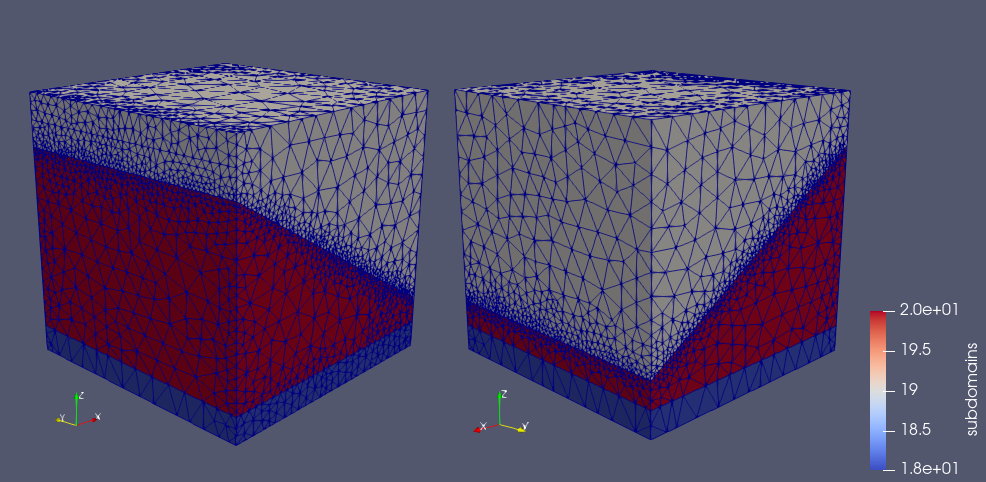
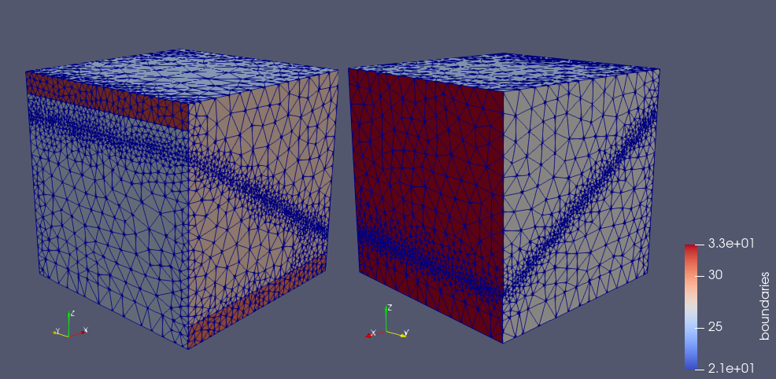
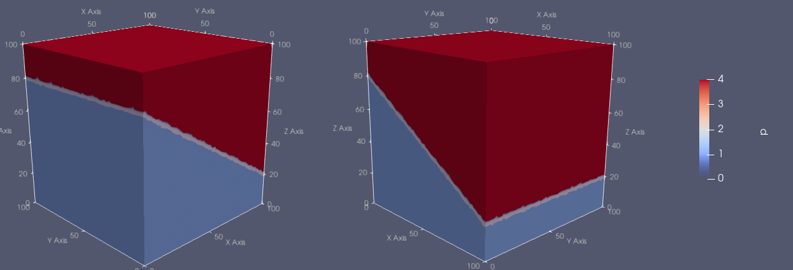
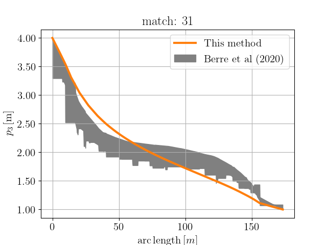

# Frac3D/LowDimensionalFracture

Solution of 3D fluid flow problems in porous media with a low dimensional fracture.

## Problem Description

We denote the pressure field in the three-dimensional domain of the porous matrix as  and the pressure field in the two-dimensional domain of the fracture as ,. The problem is to find  and , such that

for the porous matrix and

for the fracture, where  is the permeability of the porous matrix, while  and  are the permeability in the tangencial and normal directions of the fracture, respectively. Furthermore,  is given by the sum of  over the interface sections of .

Using a domain decomposition approach for , we introduce a Lagrange multiplier to handle the continuity of the solution across the interface . The resulting weak formulation is find , , ,  and  such that

for all , ,  and , and

for all .

## Numerical Solution

### Subdomains:

The domain is decomposed into three subdomains:
- Upper subdomain  (gray color, ID 19), with ;
- Lower subdomain  (red color, ID 20), with ;
- Bottom subdomain  (blue color, ID 18), with ;
- Fracture subdomain  (ID 29) between upper and lower subdomains, with  and .

	

### Boundaries:

The boundaries are subdivided into two Dirichlet boundaries and one Neumann boundary:
- Dirichlet boundary  (narrow band defined by , ID 32), with prescribed ;
- Dirichlet boundary  (narrow band defined by , ID 31), with prescribed ;
- Neumann boundary .

	

### Results:

The solution is obtained using second degree CG elements for the pressure field and Lagrange multiplier and zero-order DG elements for the permeability field.

	

The pressure field was plotted along the line  against the arc length and compared to the benchmark solution provided by [Berre <i>et al</i> (2020)](https://arxiv.org/abs/2002.07005).

	

