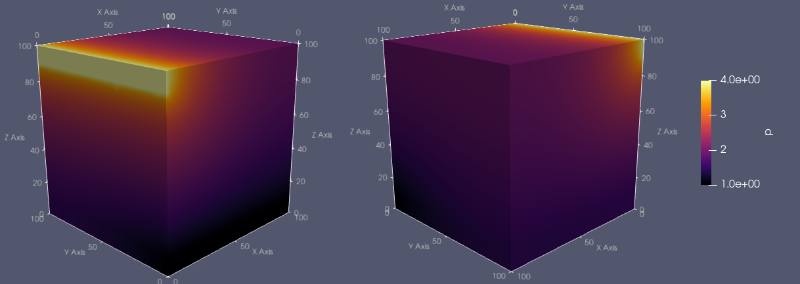

# Frac3D/Subdomains

Solution of 3D fluid flow problems in porous media with three subdomains.

## Problem Description

The problem is to find  such that

and .

The weak formulation is find , such that

for all .

## Numerical Solution

### Subdomains:

The domain is decomposed into three subdomains:
- Upper subdomain  (gray color, ID 19), with ;
- Lower subdomain  (red color, ID 20), with ;
- Bottom subdomain  (blue color, ID 18), with .

	

### Boundaries:

The boundaries are subdivided into two Dirichlet boundaries and one Neumann boundary:
- Dirichlet boundary  (narrow band defined by , ID 32), with prescribed ;
- Dirichlet boundary  (narrow band defined by , ID 31), with prescribed ;
- Neumann boundary .

	

### Results:

The solution is obtained using second degree CG elements for the pressure field and zero-order DG elements for the permeability field.

	

